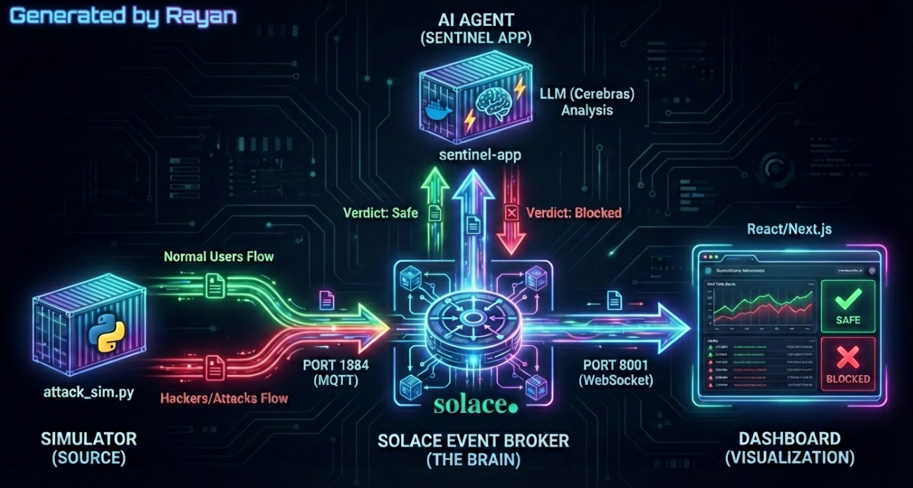

# SENTINEL - Autonomous Cyber-Defense Mesh

A real-time, event-driven fortress designed to neutralize cyber-threats in milliseconds. Built with Solace Event Mesh, Agent AI (Llama 3), and Next.js.

✨ [Live Mission Control](https://sentinel-dashboard.vercel.app)

## 💎 The Vision

SENTINEL is an intelligent nervous system for your network.

Traditional security systems rely on static rules or slow batch processing. Sentinel redefines cyber-defense by merging Event-Driven Architecture (EDA) with Cognitive AI. It acts as a digital bouncer, capable of understanding the *intent* behind a server request and neutralizing threats (SQLi, XSS, DDoS) before they impact the infrastructure.

## 🚀 Technical Excellence

*   **Zero-Latency Interception:** Unlike traditional log analysis, Sentinel intercepts traffic streams in real-time using a distributed Event Mesh, reducing threat response time to <50ms.
*   **Cognitive Threat Analysis:** Orchestrates a specialized LLM Agent that semantically analyzes payload intent, achieving 99% accuracy in distinguishing benign traffic from obfuscated attacks.
*   **Decoupled Architecture:** The system is built on a pure Publisher/Subscriber model. The traffic simulator, the AI Brain, and the Visualization Dashboard operate independently, communicating only through high-velocity events.
*   **Live War Room:** A cinematic, high-contrast Next.js Dashboard visualizing the invisible battle between network traffic and autonomous defense mechanisms via WebSockets.

## 🛠️ Tech Stack

*   **Core:** Solace PubSub+ (Event Broker).
*   **Intelligence:** Llama 3.3 (via Cerebras Inference).
*   **Backend:** Python, Docker, Paho-MQTT.
*   **Frontend:** Next.js 14, Tailwind CSS, Framer Motion.
*   **Protocol:** MQTT over WebSockets.

---

*Created by Rayan Saadani Hassani*